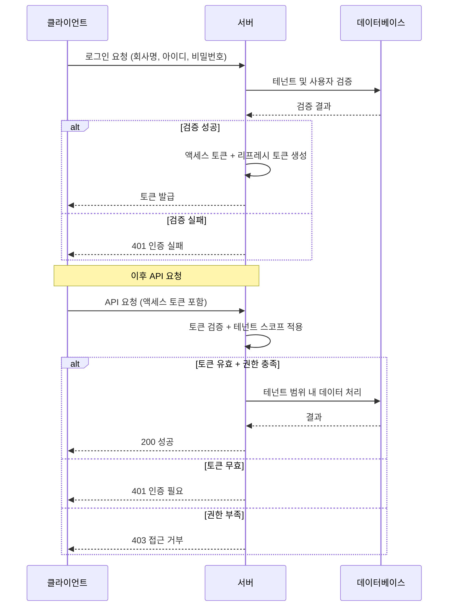

# 인증 및 권한 정책

이 문서는 시스템의 인증(Authentication)과 권한(Authorization) 정책을 정의한다.

---

## 1. 인증과 권한의 범위 정의

### 인증 (Authentication)

- **역할**: 요청자가 누구인지 확인한다
- **책임**:
  - 로그인 요청 검증
  - 토큰 발급 및 검증
  - 세션 유지 및 만료 처리

### 권한 (Authorization)

- **역할**: 인증된 사용자가 특정 리소스에 접근할 수 있는지 결정한다
- **책임**:
  - 회사(테넌트) 범위 내 데이터 접근 제어
  - 역할 기반 기능 접근 제어
  - 비인가 접근 차단

---

## 2. 인증 대상과 계정 유형

### 계정 유형

| 유형 | 설명 |
|------|------|
| 관리자 | 회원가입 시 생성되는 최초 계정. 회사 설정 및 팀원 관리 권한 보유 |
| 팀원 | 관리자가 추가한 계정. 회사 내부 데이터 접근 권한 보유 |

### 테넌트 소속 원칙

- 모든 계정은 **반드시 하나의 회사(테넌트)에 소속**된다
- 계정 생성 시 테넌트 연결이 필수이며, 이후 변경할 수 없다
- 테넌트 소속 없이 인증된 상태는 존재하지 않는다

---

## 3. 인증 방식 개요

### 로그인 기반 인증

1. 사용자가 회사명, 아이디, 비밀번호를 제출한다
2. 시스템이 자격 증명을 검증한다
3. 검증 성공 시 액세스 토큰을 발급한다

### 토큰 기반 요청 인증

- 인증된 사용자는 모든 요청에 액세스 토큰을 포함해야 한다
- 토큰이 없거나 유효하지 않으면 요청이 거부된다

---

## 4. 토큰 정책

### 액세스 토큰

| 항목 | 정책 |
|------|------|
| 역할 | API 요청 인증에 사용 |
| 포함 정보 | 사용자 식별자, 테넌트 식별자, 토큰 버전 |
| 만료 | 발급 후 일정 시간 경과 시 만료 |
| 갱신 | 리프레시 토큰을 통해 새 액세스 토큰 발급 가능 |

### 리프레시 토큰

| 항목 | 정책 |
|------|------|
| 역할 | 액세스 토큰 재발급에 사용 |
| 저장 | 서버에 해시 형태로 저장 |
| 만료 | 발급 후 일정 기간 경과 시 만료 |
| 폐기 | 로그아웃 또는 강제 무효화 시 즉시 폐기 |

### 토큰 무효화

- 전체 로그아웃(`/auth/logout-all`) 시 `tokenVersion`을 증가시켜 기존 액세스 토큰을 무효화한다
- 관리자가 특정 사용자의 토큰을 강제 무효화할 수 있다 (`POST /users/:id/invalidate-tokens`)
- 토큰 버전 불일치 시 인증이 거부된다
- 로그인 및 토큰 갱신 시 DB의 최신 `tokenVersion`이 JWT에 포함된다

> **구현 참고**: `login()` 시 DB에서 조회한 raw user 객체의 `tokenVersion`을 JWT payload에 직접 사용한다. `toSafeUser()`를 거치면 `tokenVersion`이 제거되므로, JWT 생성 전 반드시 raw user에서 값을 읽어야 한다.

### Rate Limiting (요청 횟수 제한)

브루트포스 공격 및 자동화 봇 차단을 위해 인증 API에 Rate Limiting을 적용한다.

| API 엔드포인트 | 제한 | 사유 |
|---------------|------|------|
| `/auth/login` | 5회/60초 | 비밀번호 추측 공격 방어 |
| `/auth/refresh` | 10회/60초 | 토큰 갱신 남용 방지 |
| `/auth/signup` | 3회/60초 | 자동 가입 스크립트 차단 |
| 기타 모든 API | 60회/60초 | 일반적인 DDoS 완화 |

**제한 초과 시 응답**

```json
{
  "statusCode": 429,
  "message": "ThrottlerException: Too Many Requests"
}
```

**정책 적용 범위**

- IP 주소 기반으로 요청 횟수를 추적한다
- 제한 시간(TTL) 경과 후 카운터가 리셋된다
- 제한은 클라이언트 IP별로 독립적으로 적용된다

---

## 5. 회사(테넌트) 스코프 제한

### 데이터 격리 원칙

- 모든 데이터 접근은 **요청자의 테넌트 범위로 제한**된다
- 시스템은 인증 토큰에 포함된 테넌트 정보를 기준으로 접근 범위를 결정한다
- 다른 테넌트의 데이터에 접근하는 것은 **시스템적으로 불가능**하다

### 적용 범위

- 데이터 조회 시 테넌트 필터가 자동 적용된다
- 데이터 생성 시 요청자의 테넌트가 자동 할당된다
- 데이터 수정/삭제 시 테넌트 일치 여부를 검증한다

---

## 6. 권한 개념

### 역할 기반 권한

권한은 **역할(Role)**을 통해 부여되며, 역할은 **페이지 + 동작** 단위로 정의된다.

### 권한 키 형식

```
{페이지명}.{동작명}
```

예: `users.read`, `users.create`, `roles.delete`

### 관리자 권한

- 회사 설정 관리
- 팀원 계정 추가, 수정, 비활성화
- 역할 및 권한 관리

### 팀원 권한

- 회사 내부 데이터 조회 및 처리
- 부여된 역할에 따른 기능 접근

### 권한 유효 범위

- 모든 권한은 **소속 테넌트 내에서만 유효**하다
- 동일한 권한이라도 다른 테넌트의 리소스에는 적용되지 않는다

### /auth/me 응답 구조

현재 로그인한 사용자의 정보와 권한을 조회하는 엔드포인트의 응답 구조는 다음과 같다:

```json
{
  "user": {
    "userSeq": 1,
    "userId": "admin",
    "userName": "관리자",
    "tenantId": 1,
    "tenantName": "flowdesk"
  },
  "roles": ["ADMIN", "USER_MANAGER"],
  "permissions": {
    "users.read": true,
    "users.create": true,
    "roles.read": true,
    "roles.delete": true
  },
  "menuTree": [
    {
      "pageName": "super",
      "displayName": "슈퍼 관리자",
      "path": "/super",
      "order": 1,
      "children": [
        {
          "pageName": "super.dashboard",
          "displayName": "대시보드",
          "path": "/super/dashboard",
          "order": 1,
          "children": []
        },
        {
          "pageName": "super.tenants",
          "displayName": "테넌트 관리",
          "path": "/tenants",
          "order": 2,
          "children": []
        }
      ]
    }
  ]
}
```

**응답 필드 설명**

| 필드 | 타입 | 설명 |
|------|------|------|
| `user` | Object | 사용자 기본 정보 (userSeq, userId, userName, tenantId, tenantName) |
| `roles` | String[] | 사용자에게 할당된 역할 목록 |
| `permissions` | Record<string, boolean> | 권한 빠른 조회용 flat 구조 (O(1) 조회) |
| `menuTree` | MenuTreeNode[] | 권한 기반 필터링된 메뉴 트리 (사용자가 접근 가능한 페이지만 포함) |

**menuTree 특징**

- 사용자가 `read` 권한을 가진 페이지만 포함한다
- 계층 구조를 유지한다 (부모-자식 관계)
- 프론트엔드에서 네비게이션 메뉴 렌더링에 사용한다
- 응답 크기가 최적화되어 있다 (약 800B, 기존 대비 70% 감소)

**사용 사례**

- `permissions`: 버튼 표시 제어, 라우터 가드
- `menuTree`: 사이드바 메뉴 생성
- `roles`: 역할 기반 UI 분기

---

## 6-1. Auth API 엔드포인트

| 메서드 | 경로 | 설명 | 인증 | Rate Limit |
|--------|------|------|------|------------|
| POST | `/auth/signup` | 회원가입 (회사 + 관리자 생성) | ❌ | 3회/60초 |
| POST | `/auth/login` | 로그인 | ❌ | 5회/60초 |
| POST | `/auth/refresh` | 토큰 갱신 | ❌ | 10회/60초 |
| POST | `/auth/logout` | 로그아웃 (단일 토큰 폐기) | ✅ | - |
| POST | `/auth/logout-all` | 전체 로그아웃 (모든 토큰 무효화 + tokenVersion 증가) | ✅ | - |
| GET | `/auth/me` | 내 정보 + 권한 + 메뉴트리 조회 | ✅ | - |
| POST | `/auth/change-password` | 비밀번호 변경 (본인) | ✅ | - |
| PATCH | `/auth/me/profile` | 내 프로필 수정 | ✅ | - |

### `/auth/change-password` 처리 규칙

1. 현재 비밀번호가 일치해야 한다
2. 새 비밀번호와 확인 비밀번호가 일치해야 한다
3. 새 비밀번호는 현재 비밀번호와 달라야 한다

### `/auth/me/profile` 수정 가능 필드

| 필드 | 수정 가능 |
|------|----------|
| corpName | ✅ |
| userName | ✅ |
| userEmail | ✅ |
| userTel | ✅ |
| userHp | ✅ |
| userId | ❌ (변경 불가) |
| password | ❌ (별도 API) |
| roleIds | ❌ (관리자만 변경) |

---

## 7. 예외 및 실패 처리 정책

### 인증 실패 (401)

| 상황 | 처리 |
|------|------|
| 토큰 미제출 | 요청 거부, 로그인 필요 안내 |
| 토큰 만료 | 요청 거부, 토큰 갱신 필요 |
| 토큰 위조/변조 | 요청 거부 |
| 계정 비활성화 | 요청 거부 |
| 토큰 버전 불일치 | 요청 거부, 재로그인 필요 |

### 권한 부족 (403)

| 상황 | 처리 |
|------|------|
| 필요 권한 미보유 | 요청 거부, 권한 부족 안내 |
| 다른 테넌트 리소스 접근 | 요청 거부 |

### 비정상 접근 처리 원칙

- 인증/권한 오류 시 상세 원인을 외부에 노출하지 않는다
- 내부 로그에는 상세 원인과 컨텍스트를 기록한다
- 반복적인 실패 시도는 모니터링 대상이 될 수 있다

---

## 8. Request ID (요청 추적)

### 목적

분산 환경에서 특정 요청을 추적하고 디버깅 효율성을 향상시킨다.

### Request ID 생성

- 모든 요청에 고유한 UUID 기반 Request ID가 자동 부여된다
- 클라이언트가 `X-Request-ID` 헤더를 전송하면 해당 ID를 재사용한다
- RequestIdMiddleware에서 전역 처리된다

### Request ID 포함 위치

| 위치 | 포함 방식 |
|------|----------|
| 서버 로그 | 모든 로그 항목에 `requestId` 필드 포함 |
| 에러 응답 | `meta.requestId` 필드로 클라이언트에 전달 |
| 응답 헤더 | `X-Request-ID` 헤더로 반환 |

### 에러 응답 형식 (Request ID 포함)

```json
{
  "error": {
    "code": "AUTH001",
    "message": "Authentication required",
    "statusCode": 401
  },
  "meta": {
    "requestId": "550e8400-e29b-41d4-a716-446655440000",
    "timestamp": "2026-02-01T12:34:56.789Z",
    "path": "/api/users"
  }
}
```

### 활용 시나리오

- 사용자가 에러를 보고할 때 requestId를 함께 전달하면 서버 로그에서 정확한 요청을 추적 가능
- 동일 사용자의 여러 요청을 구분하여 디버깅 가능
- 분산 환경에서 여러 서버의 로그를 requestId로 연결 가능

---

## 인증 흐름 요약


