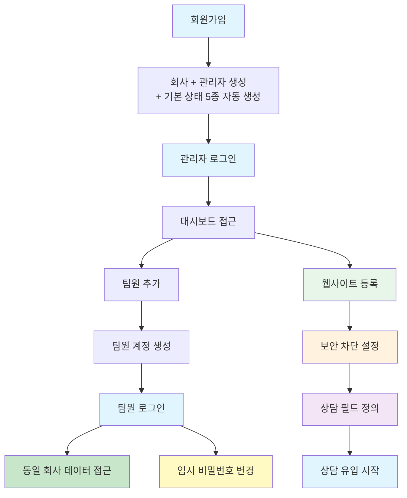

# 온보딩 가이드

이 문서는 서비스를 처음 사용하는 사람이 **최소 성공 흐름**을 따라갈 수 있도록 안내한다.

---

## 1. 회원가입

### 목적

새로운 회사(테넌트)와 관리자 계정을 생성한다.

### 사용자 행동

1. 회원가입 페이지에 접속한다
2. 회사 정보를 입력한다
   - 회사명
3. 관리자 정보를 입력한다
   - 이메일
   - 비밀번호 (영문+숫자+특수문자, 8자 이상)
   - 이름
   - 휴대폰번호 (선택)
4. 회원가입 버튼을 클릭한다

### 시스템 처리

- 회사(테넌트)를 생성한다
- 기본 상담 상태 5종(NEW, DUPLICATE, IN_PROGRESS, SCHEDULED, CONTACTED)을 자동 생성한다
- 관리자 계정을 생성하고 해당 회사에 연결한다

### 결과

- 관리자 계정으로 로그인할 수 있다

---

## 2. 관리자 로그인

### 목적

관리자 계정으로 인증하여 회사 대시보드에 접근한다.

### 사용자 행동

1. 로그인 페이지에 접속한다
2. 회사명과 아이디, 비밀번호를 입력한다
3. 로그인 버튼을 클릭한다

### 시스템 처리

- 회사명(tenantName) + 아이디 + 비밀번호를 검증한다
- 인증 성공 시 액세스 토큰 + 리프레시 토큰을 발급한다
- 리프레시 토큰은 서버에 저장되며, 액세스 토큰 만료 시 자동 갱신에 사용된다

### 결과

| 상태 | 결과 |
|------|------|
| 성공 | 회사 대시보드로 이동 |
| 실패 | 오류 메시지 표시 (회사명, 아이디 또는 비밀번호 확인 필요) |

---

## 3. 초기 설정 (관리자)

### 목적

관리자가 함께 사용할 팀원 계정을 추가한다.

### 사용자 행동

1. 대시보드에서 사용자 관리 메뉴로 이동한다
2. 팀원 추가 버튼을 클릭한다
3. 팀원 정보를 입력한다
   - 이메일
   - 임시 비밀번호
   - 이름
   - 역할
4. 저장 버튼을 클릭한다

### 시스템 처리

- 팀원 계정을 생성한다
- 동일한 회사(테넌트)에 자동 연결한다
- 지정된 역할에 따른 권한을 부여한다

### 결과

- 팀원 계정이 생성된다
- 팀원은 발급받은 이메일과 임시 비밀번호로 로그인할 수 있다

### 주의사항

- 관리자만 팀원을 추가할 수 있다
- 팀원은 관리자가 속한 회사에만 추가된다

---

## 4. 팀원 로그인

### 목적

팀원 계정으로 인증하여 회사 데이터에 접근한다.

### 사용자 행동

1. 로그인 페이지에 접속한다
2. 회사명과 아이디, 비밀번호를 입력한다
3. 로그인 버튼을 클릭한다

### 시스템 처리

- 회사명(tenantName) + 아이디 + 비밀번호를 검증한다
- 인증 성공 시 액세스 토큰 + 리프레시 토큰을 발급한다
- 소속 회사 정보를 기반으로 접근 범위를 설정한다

### 결과

- 동일 회사의 데이터에 접근할 수 있다
- 부여된 역할에 따라 기능이 제한될 수 있다
- **임시 비밀번호를 사용 중이라면 비밀번호 변경을 권장한다** (`/auth/change-password`)

### 제약사항

- 다른 회사(테넌트)의 데이터는 조회할 수 없다
- 권한이 없는 기능은 접근이 차단된다

---

## 전체 흐름 요약

---

## 5. 웹사이트 등록

### 목적

상담이 유입될 웹사이트를 등록하고, 중복 판정 기준을 설정한다.

### 사용자 행동

1. 대시보드에서 웹사이트 관리 메뉴로 이동한다
2. 웹사이트 추가 버튼을 클릭한다
3. 웹사이트 정보를 입력한다
   - 웹사이트 코드 (고유 식별자)
   - URL
   - 제목
   - 중복 허용 일수 (같은 HP+IP 조합 재접수 허용 기간)
4. 저장 버튼을 클릭한다

### 시스템 처리

- 웹사이트를 생성하고 해당 테넌트에 연결한다
- `webCode`가 상담 접수 시 테넌트 식별에 사용된다
- `duplicateAllowAfterDays`가 중복 감지 기준이 된다

### 결과

- 웹사이트가 등록된다
- 해당 `webCode`로 상담 유입이 가능해진다

---

## 6. 보안 차단 설정

### 목적

스팸이나 악성 상담을 사전에 차단하기 위한 규칙을 설정한다.

### 사용자 행동

1. 보안 관리 메뉴로 이동한다
2. 차단 유형을 선택한다 (IP / 휴대폰 / 금칙어)
3. 차단 항목을 등록한다
   - 단건 등록 또는 대량 등록 (줄바꿈/쉼표 구분)
   - 차단 사유 입력 (선택)
4. 금칙어의 경우 매칭 타입 선택 (EXACT / CONTAINS / REGEX)

### 시스템 처리

- 차단 규칙이 테넌트 단위로 저장된다
- 상담 신청(`POST /counsels`) 시 3단계 검증이 자동 수행된다:
  1. 휴대폰 번호 차단 여부
  2. IP 주소 차단 여부
  3. 이름/메모에 금칙어 포함 여부

### 결과

- 차단된 번호/IP/텍스트로 상담 신청 시 자동 거부 (400 VAL001)

---

## 7. 상담 필드 정의 (선택)

### 목적

기본 상담 필드 외에 테넌트별 커스텀 필드를 정의한다.

### 사용자 행동

1. 상담 필드 관리 메뉴로 이동한다 (DB 직접 관리 또는 향후 관리 UI)
2. 필드 정의를 추가한다
   - 필드 키 (고유 식별자)
   - 표시명
   - 필드 타입 (text, number, date, datetime, select 등)
   - 필수 여부, 정렬 순서, 기본값 등

### 시스템 처리

- 필드 정의가 `counsel_field_def` 테이블에 저장된다
- 상담 생성/수정 시 해당 필드 값이 `counsel_field_value`에 저장된다
- `GET /counsel-fields`로 활성 필드 목록 조회 가능

### 결과

- 테넌트별 맞춤 상담 입력 양식이 구성된다

---

## 8. 상담 운영 시작

### 목적

웹사이트, 보안, 필드 설정이 완료된 후 상담을 접수하고 처리한다.

### 상담 접수 (고객 → Public API)

1. 고객이 웹사이트 랜딩 페이지에서 상담을 신청한다
2. 시스템이 보안 검증 → 중복 감지 → 상담 생성을 자동 처리한다
3. 상담이 `NEW` 또는 `DUPLICATE` 상태로 생성된다

### 상담 처리 (상담원 → 관리자 API)

1. 대시보드에서 상담 목록을 확인한다 (`GET /counsels`)
2. 상담 상세를 열고 내용을 확인한다 (`GET /counsels/:id`)
3. 담당자를 지정하고 필요 시 정보를 수정한다 (`PATCH /counsels/:id`)
4. 상태를 변경한다 (`PATCH /counsels/:id/status`)
   - 예약 상태(SCHEDULED) 설정 시 `counselResvDtm` 입력 필수
5. 메모를 작성한다 (`POST /counsels/:id/memo`)

### 결과

- 상담이 상태별로 관리된다
- 상태 변경 이력과 메모가 기록된다

---

## 주요 API 경로 요약

| 단계 | API | 메서드 | 설명 |
|------|-----|--------|------|
| 회원가입 | `/auth/signup` | POST | 테넌트 + 관리자 + 기본 상태 5종 동시 생성 |
| 로그인 | `/auth/login` | POST | 액세스 토큰 + 리프레시 토큰 발급 |
| 내 정보 조회 | `/auth/me` | GET | 현재 사용자 + 역할 + 권한 + 메뉴트리 |
| 비밀번호 변경 | `/auth/change-password` | POST | 본인 비밀번호 변경 (현재 PW 검증) |
| 프로필 수정 | `/auth/me/profile` | PATCH | 내 프로필 정보 수정 |
| 팀원 추가 | `/users` | POST | 사용자 생성 (같은 테넌트) |
| 토큰 갱신 | `/auth/refresh` | POST | 리프레시 토큰으로 액세스 토큰 재발급 |
| 웹사이트 등록 | `/websites` | POST | 상담 유입 웹사이트 생성 |
| 보안 차단 등록 | `/security/block-hp` | POST | 휴대폰 차단 등록 (IP, 금칙어도 동일 패턴) |
| 보안 대량 등록 | `/security/block-hp/bulk` | POST | 대량 차단 등록 |
| 필드 정의 조회 | `/counsel-fields` | GET | 활성 상담 필드 정의 목록 |
| 상담 접수 | `/counsels` | POST | 상담 신청 (Public API, 인증 불필요) |
| 상담 목록 | `/counsels` | GET | 상담 목록 조회 (페이지네이션, 필터) |
| 상담 상세 | `/counsels/:id` | GET | 상담 상세 (fieldValues + logs + memos) |
| 상태 변경 | `/counsels/:id/status` | PATCH | 상담 상태 변경 |
| 메모 작성 | `/counsels/:id/memo` | POST | 상담 메모 작성 |
