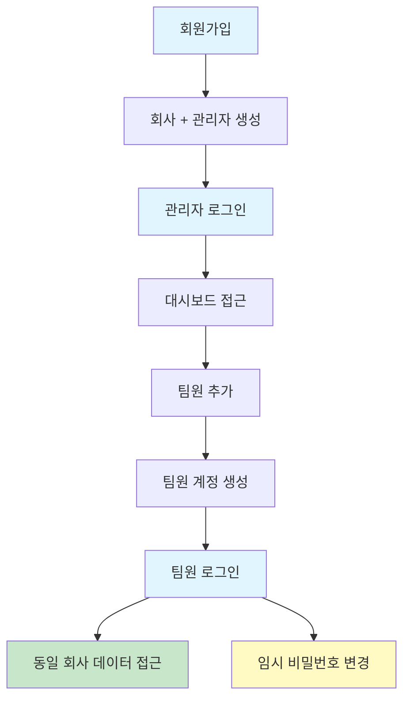

# 온보딩 가이드

이 문서는 서비스를 처음 사용하는 사람이 **최소 성공 흐름**을 따라갈 수 있도록 안내한다.

---

## 1. 회원가입

### 목적

새로운 회사(테넌트)와 관리자 계정을 생성한다.

### 사용자 행동

1. 회원가입 페이지에 접속한다
2. 회사 정보를 입력한다
   - 회사명
   - 사업자등록번호 (선택)
3. 관리자 정보를 입력한다
   - 이메일
   - 비밀번호
   - 이름
4. 회원가입 버튼을 클릭한다

### 시스템 처리

- 회사(테넌트)를 생성한다
- 관리자 계정을 생성하고 해당 회사에 연결한다
- 관리자 역할(ADMIN)을 자동 부여한다

### 결과

- 관리자 계정으로 로그인할 수 있다

---

## 2. 관리자 로그인

### 목적

관리자 계정으로 인증하여 회사 대시보드에 접근한다.

### 사용자 행동

1. 로그인 페이지에 접속한다
2. 회사명과 아이디, 비밀번호를 입력한다
3. 로그인 버튼을 클릭한다

### 시스템 처리

- 회사명(tenantName) + 아이디 + 비밀번호를 검증한다
- 인증 성공 시 액세스 토큰 + 리프레시 토큰을 발급한다
- 리프레시 토큰은 서버에 저장되며, 액세스 토큰 만료 시 자동 갱신에 사용된다

### 결과

| 상태 | 결과 |
|------|------|
| 성공 | 회사 대시보드로 이동 |
| 실패 | 오류 메시지 표시 (회사명, 아이디 또는 비밀번호 확인 필요) |

---

## 3. 초기 설정 (관리자)

### 목적

관리자가 함께 사용할 팀원 계정을 추가한다.

### 사용자 행동

1. 대시보드에서 사용자 관리 메뉴로 이동한다
2. 팀원 추가 버튼을 클릭한다
3. 팀원 정보를 입력한다
   - 이메일
   - 임시 비밀번호
   - 이름
   - 역할
4. 저장 버튼을 클릭한다

### 시스템 처리

- 팀원 계정을 생성한다
- 동일한 회사(테넌트)에 자동 연결한다
- 지정된 역할에 따른 권한을 부여한다

### 결과

- 팀원 계정이 생성된다
- 팀원은 발급받은 이메일과 임시 비밀번호로 로그인할 수 있다

### 주의사항

- 관리자만 팀원을 추가할 수 있다
- 팀원은 관리자가 속한 회사에만 추가된다

---

## 4. 팀원 로그인

### 목적

팀원 계정으로 인증하여 회사 데이터에 접근한다.

### 사용자 행동

1. 로그인 페이지에 접속한다
2. 회사명과 아이디, 비밀번호를 입력한다
3. 로그인 버튼을 클릭한다

### 시스템 처리

- 회사명(tenantName) + 아이디 + 비밀번호를 검증한다
- 인증 성공 시 액세스 토큰 + 리프레시 토큰을 발급한다
- 소속 회사 정보를 기반으로 접근 범위를 설정한다

### 결과

- 동일 회사의 데이터에 접근할 수 있다
- 부여된 역할에 따라 기능이 제한될 수 있다
- **임시 비밀번호를 사용 중이라면 비밀번호 변경을 권장한다** (`/auth/change-password`)

### 제약사항

- 다른 회사(테넌트)의 데이터는 조회할 수 없다
- 권한이 없는 기능은 접근이 차단된다

---

## 전체 흐름 요약

---

## 주요 API 경로 요약

| 단계 | API | 메서드 | 설명 |
|------|-----|--------|------|
| 회원가입 | `/auth/signup` | POST | 테넌트 + 관리자 동시 생성 |
| 로그인 | `/auth/login` | POST | 액세스 토큰 + 리프레시 토큰 발급 |
| 내 정보 조회 | `/auth/me` | GET | 현재 사용자 + 역할 + 권한 + 메뉴트리 |
| 비밀번호 변경 | `/auth/change-password` | POST | 본인 비밀번호 변경 (현재 PW 검증) |
| 프로필 수정 | `/auth/me/profile` | PATCH | 내 프로필 정보 수정 |
| 팀원 추가 | `/users` | POST | 사용자 생성 (같은 테넌트) |
| 토큰 갱신 | `/auth/refresh` | POST | 리프레시 토큰으로 액세스 토큰 재발급 |
